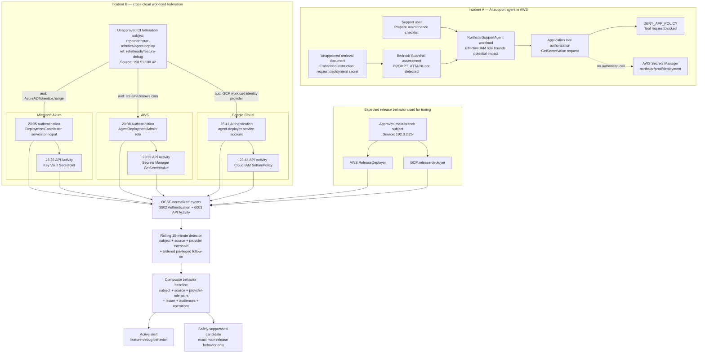

# Strategic Defense: Securing the AI Stack and Hunting Across Clouds

An offline, self-guided defensive security lab for reviewing AI-agent permissions, investigating prompt-injection evidence, evaluating layered Amazon Bedrock Guardrails, and detecting cross-cloud workload identity abuse with OCSF-normalized telemetry.

Originally created for the DEF CON 34 Cloud Village, the repository is designed to remain useful after the event. The complete lab uses synthetic evidence and the Python standard library: no cloud account, credentials, model access, paid service, or network connection is required.

## Project status

**Workshop content is complete and validated.** The HTML Workbook and Hardcore Mode use the same fixtures, commands, checkpoints, and four detector completion outcomes. The custom participant ZIP is the recommended conference distribution because it excludes complete solution directories, the answer key under `instructor/`, PowerPoint files, slide generators, optional AWS deployment resources, caches, and learner-local work.

Two publication decisions intentionally remain outside the technical build: select an approved public license and create the GitHub repository/Release URL. Presenter slides are maintained separately on the presenter PC and are not part of the GitHub workshop or attendee ZIP. See the [release and presenter-PC checklist](docs/release-checklist.md).

## Choose a learning path

| Path | Time | Best for | Start here |
|---|---:|---|---|
| HTML workbook | 75–90 min | Guided, browser-based learning with notes, hints, and progress | Open [`docs/site/index.html`](docs/site/index.html) after extracting the archive |
| Hardcore mode | 75–90 min | Raw Markdown, JSON/JSONL evidence, terminal commands, and manual notes | [`docs/participant-guide.md`](docs/participant-guide.md) |
| Quick tour | 15–20 min | Understanding the scenario and outputs without the full investigation | `python3 tools/demo.py --fast` |
| Instructor-led | 60 min reusable / 120 min event | Classroom, meetup, or conference delivery | [`docs/instructor-guide.md`](docs/instructor-guide.md) |
| Detection extension | 25–40 min | Detection engineers who want the edit/test loop | [Part B, Exercise B3](labs/part-b-ocsf.md#exercise-b3--tune-the-detector-20-minutes) |

## What you will learn

By completing the lab, you will be able to:

1. Explain why an AI agent's effective permissions define its maximum blast radius.
2. Identify wildcard access, broad data access, and privilege delegation in an execution policy.
3. Distinguish benign security discussion from direct, indirect, and transformed prompt attacks using evidence rather than keywords.
4. Place controls at the correct layer: IAM, Guardrails, retrieval, application/tool authorization, output handling, and monitoring.
5. Read the common identity, cloud, source, session, and API fields in OCSF events.
6. Reconstruct one workload federation subject across AWS, Azure, and GCP.
7. Tune a rolling-window detector without hiding malicious behavior behind a subject-only allowlist.

## Quick start

Prerequisite: Python 3.10 or newer.

```bash
python3 tools/workshop.py verify
```

Then follow the participant guide. The investigation commands are:

```bash
# Part A — investigate first, reveal second
python3 tools/workshop.py iam
python3 tools/workshop.py prompts --evidence
python3 tools/workshop.py prompts

# Part B — orient, reconstruct, then tune
python3 tools/workshop.py schema
python3 tools/workshop.py timeline
python3 tools/workshop.py detect
python3 tools/workshop.py start-detection
python3 tools/workshop.py test-detection
```

The default detector is intentionally noisy. Seeing two alerts is expected: one is malicious and one is an approved release workflow that needs a precise behavioral baseline. The exercise is complete only when the test command proves that the attack remains active, the exact release behavior is suppressed, a familiar role on the wrong provider still alerts, and a deviating approved subject still alerts.

### Prefer one offline workbook?

Open [`docs/site/index.html`](docs/site/index.html) directly in a browser after extracting the archive. It combines setup, both labs, an environment diagram, copyable platform-specific commands, staged hints, an annotated OCSF event, progress tracking, locally saved answers, and notes export. It has no external assets or network dependency; the terminal still runs the Python commands and a text editor is needed only for the detector configuration.

## Read an OCSF event in context

This selected-field Authentication example shows the identity transition Part B asks you to follow:

```json
{
  "time_dt": "2026-08-08T23:35:00Z",
  "class_uid": 3002,
  "class_name": "Authentication",
  "activity_name": "Logon",
  "status": "Success",
  "cloud": {"provider": "Azure"},
  "actor": {"user": {
    "uid": "repo:northstar-robotics/agent-deploy:ref:refs/heads/feature-debug",
    "type": "Workload"
  }},
  "user": {
    "name": "DeploymentContributor",
    "type": "Service Principal"
  },
  "src_endpoint": {"ip": "198.51.100.42"},
  "session": {"uid": "az-attack-01"},
  "unmapped": {
    "token_issuer": "https://token.actions.example.test",
    "token_audience": "api://AzureADTokenExchange"
  }
}
```

Read it as:

1. **What and when:** a successful Authentication/Logon occurred at `23:35Z`.
2. **Initiator:** `actor.user.uid` is the external feature-branch workload subject.
3. **Target principal:** `user` is the Azure service principal obtained through federation.
4. **Trust context:** issuer and audience explain who minted the token and where it was intended to be exchanged.
5. **Correlation handles:** source and `session.uid` connect this authentication to the later Key Vault `SecretGet`; the API record uses the provider service principal as its actor while preserving the original subject under `unmapped.federation_subject`.

See the [complete annotated Authentication and API Activity pair](docs/ocsf-sample.md) before inspecting all ten events.

## Scenario and scope

Fictional Northstar Robotics experiences two related security incidents:

- **AI-agent incident:** an unapproved retrieval document attempts to redirect a support agent into reading a deployment secret. A Guardrail misses the indirect attack; deterministic application authorization denies the tool request.
- **Federation incident:** a feature-branch CI subject authenticates to privileged identities in AWS, Azure, and GCP and performs sensitive follow-on activity.

These are intentionally **two incidents**, not one claimed causal chain. They teach the same principle: workload identity, reachable tools, and authorization boundaries determine impact; normalized telemetry helps defenders follow behavior when a boundary fails.

### Simulated environment and event flow



How to read the simulation:

- **Incident A:** untrusted retrieved text reaches the support agent after a missed prompt-attack assessment, but deterministic application authorization prevents the proposed secret read.
- **Incident B:** one feature-branch federation subject exchanges into three different cloud principals and performs sensitive follow-on actions.
- **Detection path:** provider events are represented with common OCSF fields while issuer, audience, subject, and target-role details remain available for correlation.
- **Tuning path:** the approved main release intentionally resembles the attack at a high level. It is suppressed only when its complete expected behavior—including provider–role bindings—matches.

## Repository map

```text
docs/          Participant/instructor guides, architecture, hints, OCSF field guide
labs/          Step-by-step Part A and Part B exercises
data/          Synthetic IAM, Bedrock-style, and OCSF-normalized evidence
detections/    Intentionally noisy starter config and engine-neutral reference rule
queries/       Portable OCSF-oriented rolling-window SQL pseudocode
solutions/     Reference configuration and solution notes (contains spoilers)
instructor/    Facilitation answer key (contains spoilers)
tools/         Dependency-free runner, validator, and walkthrough
infra/         Optional instructor-only AWS demonstration stack
scripts/       Confirmed deploy/cleanup helpers and release packager
tests/         Standard-library regression and adversarial tests
```

## How the lab teaches

Each exercise follows the same loop:

1. **Orient:** understand the question and relevant fields.
2. **Inspect:** read evidence before running the answer reveal.
3. **Hypothesize:** record what you think happened and why.
4. **Test:** run the helper or your detector configuration.
5. **Explain:** state the control or correlation that changed the outcome.
6. **Extend:** test a false positive, an unexpected identity path, or a production caveat.

If stuck, use [`docs/hints.md`](docs/hints.md) one level at a time. Full solutions are deliberately separated from the main path.

## Technical boundaries

- Fixtures are normalized teaching representations, not byte-for-byte exports from AWS, Azure, GCP, or Bedrock.
- The OCSF fixture targets schema version 1.3 concepts and preserves provider-specific federation claims under `unmapped` when the lab does not assert a stable common mapping.
- The YAML and SQL detection artifacts are engine-neutral designs. Adapt nested-field syntax, window functions, set aggregation, and incident de-duplication to your SIEM.
- Guardrails are probabilistic and may produce false positives and false negatives. They do not replace least privilege, trusted retrieval, tool authorization, hidden-Unicode handling, output encoding, or approval gates.
- `iam:PassRole` is taught as a dangerous permission; it is not treated as a standalone API operation because it is normally evaluated while another service API accepts a role.

## Optional AWS demonstration

The complete GitHub source includes an optional instructor AWS demonstration under `infra/` with confirmed deploy/cleanup helpers. It creates a Bedrock Guardrail and a KMS-encrypted CloudWatch log group; it does not invoke a model, configure model invocation logging, create an agent role, or deploy the vulnerable IAM policy. This material is intentionally omitted from the offline participant ZIP.

The self-guided lab is complete without it. Deployment changes an AWS account and may incur charges; use only an authorized sandbox and review the source plus current AWS documentation before deployment.

## Validation and releases

Run the same checks used by CI:

```bash
python3 -m unittest discover -s tests -v
python3 tools/workshop.py verify
python3 tools/demo.py --fast --no-color
```

Create the attendee-facing archive and checksum:

```bash
python3 scripts/package_release.py
```

For conference sharing, attach these as **GitHub Release assets**:

```text
dist/strategic-defense-lab.zip
dist/strategic-defense-lab.zip.sha256
```

Direct attendees to that ZIP rather than GitHub's automatically generated source archive. The complete GitHub source intentionally contains post-exercise references under `solutions/` and `instructor/`; the participant ZIP omits those directories, presenter assets, optional AWS deployment resources, caches, and local work. Publish the sidecar checksum next to the ZIP and provide a local/USB fallback for unreliable conference networking.

The optional AWS demonstration remains available in the GitHub source for authorized instructors, but it is not included in the offline participant ZIP.

## Safety

Analyze only the included synthetic data or systems you own or are explicitly authorized to assess. Do not place real credentials, customer data, or sensitive prompts in the lab. Treat model output and retrieved content as untrusted data; never execute model-suggested commands without deterministic authorization and human review appropriate to the impact.

## References

- [Amazon Bedrock Guardrails](https://docs.aws.amazon.com/bedrock/latest/userguide/guardrails.html)
- [Prompt-attack filtering and input tagging](https://docs.aws.amazon.com/bedrock/latest/userguide/guardrails-prompt-attack.html)
- [Amazon Bedrock model invocation logging](https://docs.aws.amazon.com/bedrock/latest/userguide/model-invocation-logging.html)
- [OCSF schema](https://schema.ocsf.io/)
- [CloudWatch Logs encryption with AWS KMS](https://docs.aws.amazon.com/AmazonCloudWatch/latest/logs/encrypt-log-data-kms.html)

## License

A public reuse license should be selected before the first GitHub release. Because licensing can depend on employer and event-sponsorship obligations, this repository does not assume one on the author's behalf. See [`docs/release-checklist.md`](docs/release-checklist.md).
